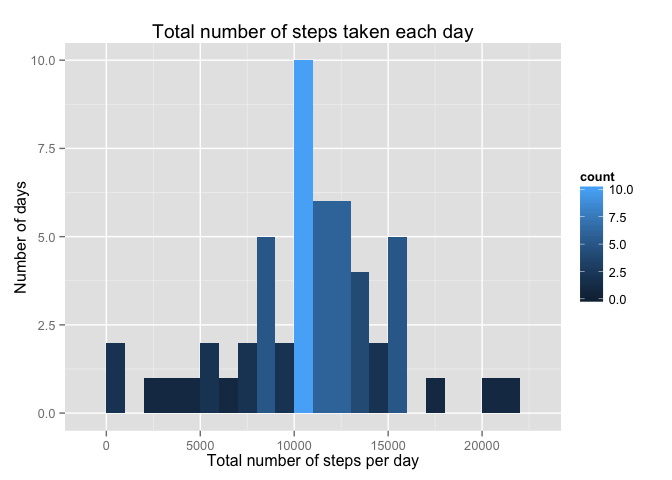
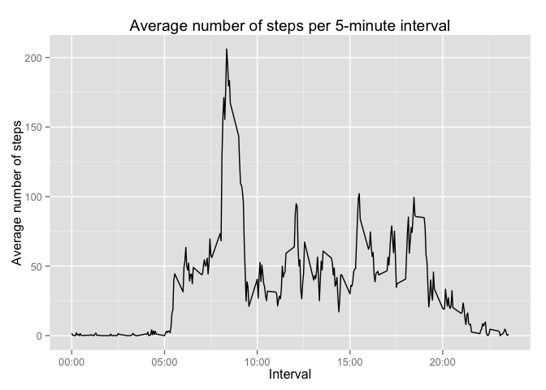
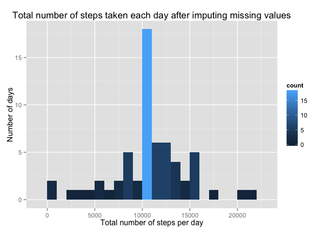
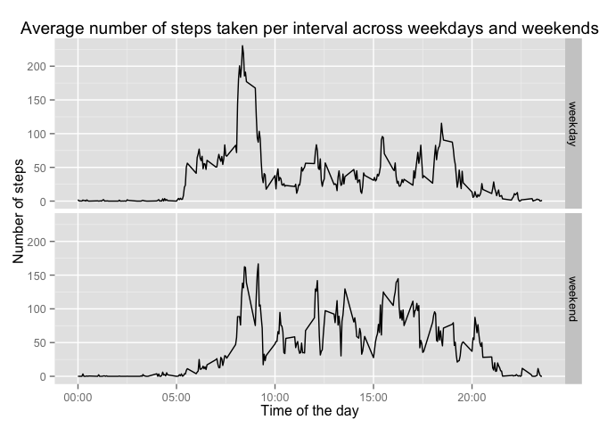

# Exploring activity monitoring data
Molina Rafidison  
16 Feb 2016  
  
### Loading and preprocessing the data  

First of all, let us load any package we would need to run the full analysis. 


```r
packages <- c("dplyr", "ggplot2", "knitr")
sapply(packages, require, character.only = TRUE, quietly = TRUE)
```

```
##   dplyr ggplot2   knitr 
##    TRUE    TRUE    TRUE
```

And set the path.  
Make sure to be in the right working directory.


```r
path <- getwd()
```

Unzip the zip file containing the data if the csv files does not exist in the working directory.


```r
if (!file.exists("activity.csv")) {
    unzip(file.path(path, "activity.zip"))
}
```

Load the data and assign it to the variable `activity`.


```r
activity <- read.csv(file.path(path, "activity.csv"))
```

Let us have a look at what the data look like.


```r
str(activity)
```

```
## 'data.frame':	17568 obs. of  3 variables:
##  $ steps   : int  NA NA NA NA NA NA NA NA NA NA ...
##  $ date    : Factor w/ 61 levels "2012-10-01","2012-10-02",..: 1 1 1 1 1 1 1 1 1 1 ...
##  $ interval: int  0 5 10 15 20 25 30 35 40 45 ...
```

```r
summary(activity)
```

```
##      steps                date          interval     
##  Min.   :  0.00   2012-10-01:  288   Min.   :   0.0  
##  1st Qu.:  0.00   2012-10-02:  288   1st Qu.: 588.8  
##  Median :  0.00   2012-10-03:  288   Median :1177.5  
##  Mean   : 37.38   2012-10-04:  288   Mean   :1177.5  
##  3rd Qu.: 12.00   2012-10-05:  288   3rd Qu.:1766.2  
##  Max.   :806.00   2012-10-06:  288   Max.   :2355.0  
##  NA's   :2304     (Other)   :15840
```

Note that the `date` variable is set as a 'factor'. For potential later use, this variable will be transformed into class 'date'.  


```r
activity$date <- as.Date(activity$date, "%Y-%m-%d")
```

The `interval` variable is actually giving hours and minutes during a day. "0" means "00:00", "140" reprensents "01:40" and so forth.This will be useful for the tick marks in the plots.  
Here is a view on the first few lines of the data frame.


```r
head(activity, 10)
```

```
##    steps       date interval
## 1     NA 2012-10-01        0
## 2     NA 2012-10-01        5
## 3     NA 2012-10-01       10
## 4     NA 2012-10-01       15
## 5     NA 2012-10-01       20
## 6     NA 2012-10-01       25
## 7     NA 2012-10-01       30
## 8     NA 2012-10-01       35
## 9     NA 2012-10-01       40
## 10    NA 2012-10-01       45
```


### What is mean total number of steps taken per day?  

For this part, we will ignore the 2304 missing values (NA) of the `steps` variable.


```r
activityClean <- filter(activity, !is.na(steps))
```

Calculate the total number of steps per day by creating a summmarizing data frame. This `dailySteps` data frame contains two variables: `date` and `totalSteps`, which is the total number of steps taken each day.


```r
dailySteps <- activityClean %>%
    group_by(date) %>%
    summarize(totalSteps = sum(steps))
print(dailySteps)
```

```
## Source: local data frame [53 x 2]
## 
##          date totalSteps
##        (date)      (int)
## 1  2012-10-02        126
## 2  2012-10-03      11352
## 3  2012-10-04      12116
## 4  2012-10-05      13294
## 5  2012-10-06      15420
## 6  2012-10-07      11015
## 7  2012-10-09      12811
## 8  2012-10-10       9900
## 9  2012-10-11      10304
## 10 2012-10-12      17382
## ..        ...        ...
```

Make a histogram of the total number of steps taken each day.


```r
ggplot(data = dailySteps, aes(dailySteps$totalSteps)) + 
    geom_histogram(aes(fill = ..count..), binwidth = 1000) +
    labs(x = "Total number of steps per day",
         y = "Number of days",
         title = "Total number of steps taken each day")
```



Report the mean and the median of the total number of steps taken per day thanks to the information that the `summary()` function gives us.


```r
summary(dailySteps$totalSteps)
```

```
##    Min. 1st Qu.  Median    Mean 3rd Qu.    Max. 
##      41    8841   10760   10770   13290   21190
```

We could have calculated the mean and the median this way:


```r
mean(dailySteps$totalSteps)
```

```
## [1] 10766.19
```

```r
median(dailySteps$totalSteps)
```

```
## [1] 10765
```
  
We now know that the total number of steps taken per day has a **mean of 10,766.19 steps** and that the **median is at 10,765 steps** per day.  
*Interesting fact*: we have a difference of **0.035%** for the mean and **0.046%** for the median between the summary and the calculations.

---
### What is the average daily activity pattern?  
---

Calculate the average number of steps per interval accross all days.


```r
averageSteps <- activityClean %>%
    group_by(interval) %>%
    summarize(avgSteps = mean(steps))
print(averageSteps)
```

```
## Source: local data frame [288 x 2]
## 
##    interval  avgSteps
##       (int)     (dbl)
## 1         0 1.7169811
## 2         5 0.3396226
## 3        10 0.1320755
## 4        15 0.1509434
## 5        20 0.0754717
## 6        25 2.0943396
## 7        30 0.5283019
## 8        35 0.8679245
## 9        40 0.0000000
## 10       45 1.4716981
## ..      ...       ...
```

Let us have a look at the summary of this data frame!


```r
summary(averageSteps)
```

```
##     interval         avgSteps      
##  Min.   :   0.0   Min.   :  0.000  
##  1st Qu.: 588.8   1st Qu.:  2.486  
##  Median :1177.5   Median : 34.113  
##  Mean   :1177.5   Mean   : 37.383  
##  3rd Qu.:1766.2   3rd Qu.: 52.835  
##  Max.   :2355.0   Max.   :206.170
```

Look at how the average of steps within 5 minutes can be quite low.  
  
Make a time series plot (`type = 'l'`) of the 5-minute interval and the average number of steps per interval calculated above.


```r
ggplot(averageSteps, aes(interval, avgSteps)) + 
    geom_line() +
    labs(x = "Interval",
         y = "Average number of steps",
         title = "Average number of steps per 5-minute interval") +
    scale_x_continuous(breaks = c(0, 500, 1000, 1500, 2000), 
                     labels = c("00:00", "05:00", "10:00", "15:00", "20:00"))
```



Now find, on average across all the days in the dataset, the interval that contains the maximum number of steps.


```r
maxInterval <- averageSteps %>%
    filter(avgSteps == max(avgSteps))
print(maxInterval)
```

```
## Source: local data frame [1 x 2]
## 
##   interval avgSteps
##      (int)    (dbl)
## 1      835 206.1698
```

This interval has **835 as its identifier**. That means that the maximum number of steps is taken at **08:35** with a total of **206.1698 steps**.


### Imputing missing values  

In the previous parts, we ignored and removed the missing values.  
But there are a number of days/intervals where there are missing values (coded as 𝙽𝙰) and the presence of missing days may introduce bias into some calculations or summaries of the data.
  
As a reminder, here was the total number of missing values in the dataset. We calculate it in a different way.


```r
sum(is.na(activity$steps))
```

```
## [1] 2304
```

We have then 2,304 missing values regarding `steps` in our dataset.  
  
**Here is our strategy for filling in all of the missing values in the dataset: we will replace the NAs with the average number of steps for the corresponding interval.**  
First, subset all the rows from the original dataset where the `steps` value is missing.


```r
activityNA <- filter(activity, is.na(steps))
head(activityNA, 10)
```

```
##    steps       date interval
## 1     NA 2012-10-01        0
## 2     NA 2012-10-01        5
## 3     NA 2012-10-01       10
## 4     NA 2012-10-01       15
## 5     NA 2012-10-01       20
## 6     NA 2012-10-01       25
## 7     NA 2012-10-01       30
## 8     NA 2012-10-01       35
## 9     NA 2012-10-01       40
## 10    NA 2012-10-01       45
```

Then merge this dataset to the one we have created with the average number of steps per interval.


```r
activityNA <- activityNA %>% merge(averageSteps, by = "interval")

## Replace 'steps' by 'avgSteps' converted into integers
activityNAFull <- activityNA %>% 
    mutate(steps = replace(steps, is.na(steps), as.integer(avgSteps))) %>%
    select(steps, date, interval) %>%
    arrange(date)
```

Now that the missing values are no longer ones, join the dataset that ignored the NAs and the new dataset with the average values.


```r
activityFull <- rbind(activityNAFull, activityClean)
head(activityFull, 10)
```

```
##    steps       date interval
## 1      1 2012-10-01        0
## 2      0 2012-10-01        5
## 3      0 2012-10-01       10
## 4      0 2012-10-01       15
## 5      0 2012-10-01       20
## 6      2 2012-10-01       25
## 7      0 2012-10-01       30
## 8      0 2012-10-01       35
## 9      0 2012-10-01       40
## 10     1 2012-10-01       45
```

Here we are! We just created a new dataset that is equal to the original dataset but with the missing data filled in.  
  
Let us make a histogram like the one we have made before with the total number of steps taken each day.  
We need to sum the new total number of steps per day.


```r
dailyStepsFull <- activityFull %>%
    group_by(date) %>%
    summarize(totalSteps = sum(steps))
print(dailyStepsFull)
```

```
## Source: local data frame [61 x 2]
## 
##          date totalSteps
##        (date)      (int)
## 1  2012-10-01      10641
## 2  2012-10-02        126
## 3  2012-10-03      11352
## 4  2012-10-04      12116
## 5  2012-10-05      13294
## 6  2012-10-06      15420
## 7  2012-10-07      11015
## 8  2012-10-08      10641
## 9  2012-10-09      12811
## 10 2012-10-10       9900
## ..        ...        ...
```

And make a new histogram of the total number of steps taken each day.  


```r
ggplot(data = dailyStepsFull, aes(dailyStepsFull$totalSteps)) + 
    geom_histogram(aes(fill = ..count..), binwidth = 1000) +
    labs(x = "Total number of steps per day",
         y = "Number of days",
         title = "Total number of steps taken each day after imputing missing values")
```



Again calculate the mean and the median. 


```r
mean(dailyStepsFull$totalSteps)
```

```
## [1] 10749.77
```

```r
median(dailyStepsFull$totalSteps)
```

```
## [1] 10641
```

The total number of steps taken per day, after imputing the missing value, has a **mean of 10,749.77 steps** and that the **median is at 10,765 steps** per day versus respectively **10,766.19** and **10,641**.  
These values differ from the first ones but the difference is between them is low. We have a difference of **0.152%** for the mean and **1.152%** for the median between both computations.  
The reason is that we replaced the missing values by the average values, which does not change the median and the mean that much.  
On the other hand, the spike at 10,000 steps is higher here and so is the median. But the mean is slightly lower. 

### Are there differences in activity patterns between weekdays and weekends?

For this question, use the new dataset with the filled-in missing values.  
Create a new factor variable in the dataset, called `weekMoment`, with two levels – “weekday” and “weekend” indicating whether a given date is a weekday or weekend day.


```r
## Creating a variable containing the weekday
dateDay <- c("Monday", "Tuesday", "Wednesday", "Thursday", "Friday")

## Adding a column to the 'activityFull' dataset, which is a factor of the weekdays.
## Are considered as weekdays when in 'dateDay' else are weekend days.
activityFull <- activityFull %>%
    mutate(weekMoment = factor(weekdays(activityFull$date) %in% dateDay,
                               levels = c(TRUE, FALSE),
                               labels = c("weekday", "weekend")))
```

Calculate the average number of steps per interval accross weekdays.


```r
weekSteps <- activityFull %>%
    group_by(interval, weekMoment) %>%
    summarize(avgWeekSteps = mean(steps))
print(weekSteps)
```

```
## Source: local data frame [576 x 3]
## Groups: interval [?]
## 
##    interval weekMoment avgWeekSteps
##       (int)     (fctr)        (dbl)
## 1         0    weekday   2.15555556
## 2         0    weekend   0.12500000
## 3         5    weekday   0.40000000
## 4         5    weekend   0.00000000
## 5        10    weekday   0.15555556
## 6        10    weekend   0.00000000
## 7        15    weekday   0.17777778
## 8        15    weekend   0.00000000
## 9        20    weekday   0.08888889
## 10       20    weekend   0.00000000
## ..      ...        ...          ...
```

Make another time series plot of the 5-minute interval and the average number of steps across the weekdays and the weekend days thanks to two panels.


```r
ggplot(weekSteps, aes(interval, avgWeekSteps)) + 
    geom_line() +
    facet_grid(weekMoment ~ .) +
    labs(x = "Time of the day",
        y = "Number of steps",
         title = "Average number of steps taken per interval across weekdays and weekends") +
    scale_x_continuous(breaks = c(0, 500, 1000, 1500, 2000), 
                     labels = c("00:00", "05:00", "10:00", "15:00", "20:00"))
```



We are all set for this exploratory analysis!
